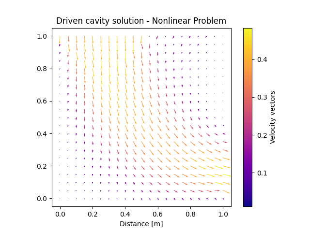

## Solution of Driven cavity problem
This project represents a simulation of a Driven cavity problem, using the Finite Element Method.

The solution proposed considers the non-linearities of the problem, solving the Navier Stokes equations that represents the physics behavior.

The solution can be represented in a graphic with the vectors of the velocity as shown

And if we change the boundary conditions, we can observe the next distribution of velocities

### Note:
* You can find the whole project solved
* You can find a requirements.txt with all the necessary packages
* This project was made only with academics purposes

The report is found here 

[report.pdf](https://github.com/GABusta/DrivenCavity/blob/main/report.pdf)
